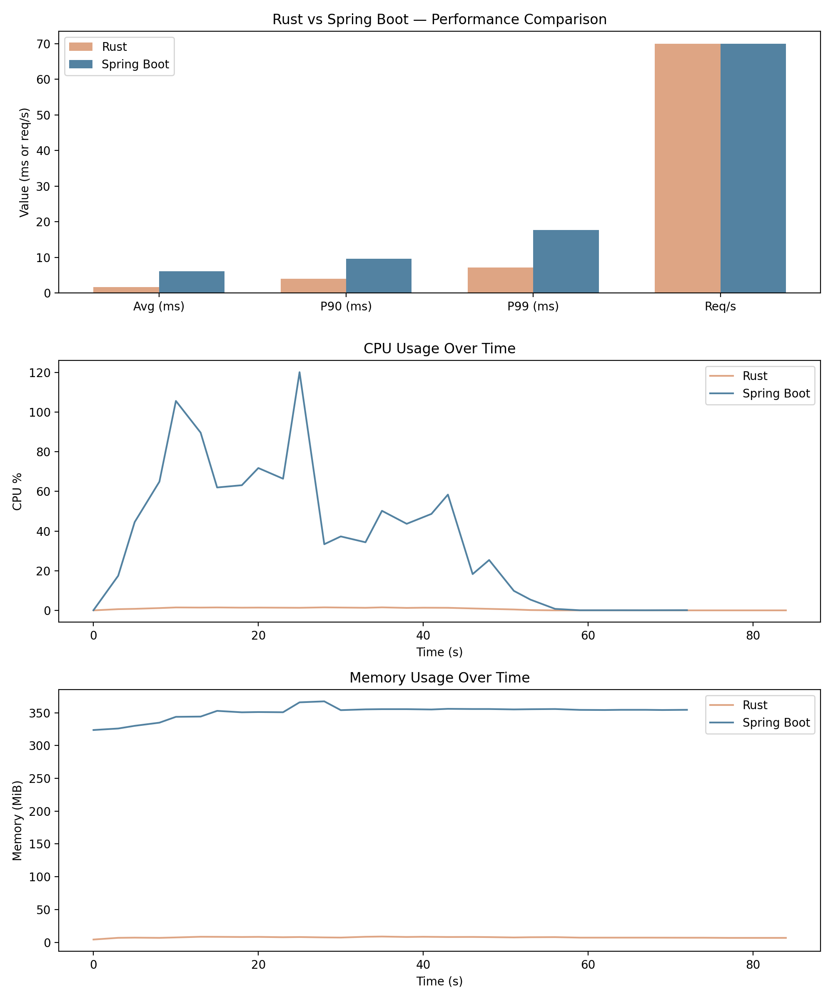

# 🎬 Movierama

Movierama is a social movie sharing platform where users can share their favorite movies, like or hate movies, and explore submissions from other users.

---

## 🏗 Project Overview

- Users can **sign up** or **log in**.
- Registered users can **add movies** with a title, description, and date.
- Users can **vote** (like or hate) on movies submitted by others.  
  - Votes are limited to one per movie per user.  
  - Users can change or retract their votes.
  - Users **cannot vote** for movies they submitted.
- Movie listings display:
  - Title
  - Description
  - Name of the submitting user (clickable to filter by user)
  - Date of publication
  - Number of likes
  - Number of hates
- Movies can be **sorted** by likes, hates, or publication date.

---

## 🧰 Technology Stack

| Layer        | Technology                        |
| ------------ | --------------------------------- |
| Backend      | Rust, axum, sqlx                 |
| Database     | PostgreSQL                        |
| Frontend     | Vue.js, Bun                       |
| Containerization | Docker, Docker Compose        |

---

## 🏠 Running Movierama

Movierama is fully containerized with Docker. The backend, frontend, and database run in separate containers on a shared network.

### Prerequisites

- Docker
- Docker Compose 

---

### Start the Application

```bash
docker compose up --build
```

### Stop the Application

```bash
docker compose down
```

### Open in Browser

After starting, open http://localhost:5173.

---
Perfect — based on your **new benchmark data** and Docker resource metrics, here’s the updated and polished README section for your **Performance Comparison**, including insights from your latest results and your dashboard image (`comparison_dashboard.png`):

---

## ⚡ Performance Comparison — Rust vs. Spring Boot

As part of the migration from the original **Java (Spring Boot)** backend to the new **Rust (Axum)** backend, I performed detailed load and resource usage tests using [Grafana k6](https://grafana.com/docs/k6/latest/).

The tests simulated a consistent load of **70 requests per second** for both backends over the same duration, capturing **latency metrics** and **Docker resource usage** (CPU and memory).

| Metric                          |  Rust (Axum) | Spring Boot (Java) | Notes                                         |
| :------------------------------ | -----------: | -----------------: | :-------------------------------------------- |
| **Average latency (avg)**       | **≈ 1.7 ms** |           ≈ 6.2 ms | Rust handled requests ~3.5× faster on average |
| **90th percentile (p90)**       | **≈ 4.0 ms** |           ≈ 9.6 ms | 90% of Rust responses completed under 4 ms    |
| **99th percentile (p99)**       | **≈ 7.2 ms** |          ≈ 17.6 ms | Rust remains low-latency even at tail load    |
| **Requests per second (req/s)** |     70 req/s |           70 req/s | Identical test load for both                  |

---

### 🧩 Interpretation

* **🚀 Rust (Axum)** delivers much **lower latency** and **tighter consistency**, thanks to its zero-cost abstractions and async runtime efficiency.
* **☕ Spring Boot**, while robust and feature-rich, incurs overhead from the JVM, garbage collection, and heavier threading, resulting in higher average and tail latencies.
* **⚙️ CPU usage**: Rust’s CPU footprint was only a fraction of Spring’s, remaining under **5 %** even during steady load, whereas Spring Boot frequently spiked above **100 %**.
* **🧠 Memory usage**: Rust consistently stayed around **5 MiB**, while Spring hovered between **300–360 MiB**, mostly due to JVM overhead.

These results demonstrate that **Rust’s Axum-based backend is dramatically more efficient**, making it ideal for high-performance, resource-constrained, or latency-sensitive systems.

---

### 📊 Visualization



This dashboard summarizes:

* **Top:** Latency comparison (avg, p90, p99, req/s)
* **Middle:** CPU usage over time
* **Bottom:** Memory usage over time

